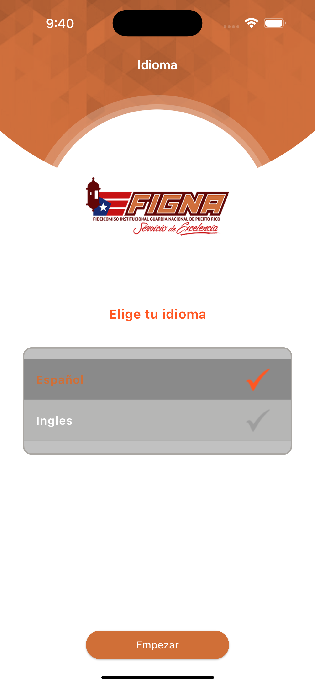
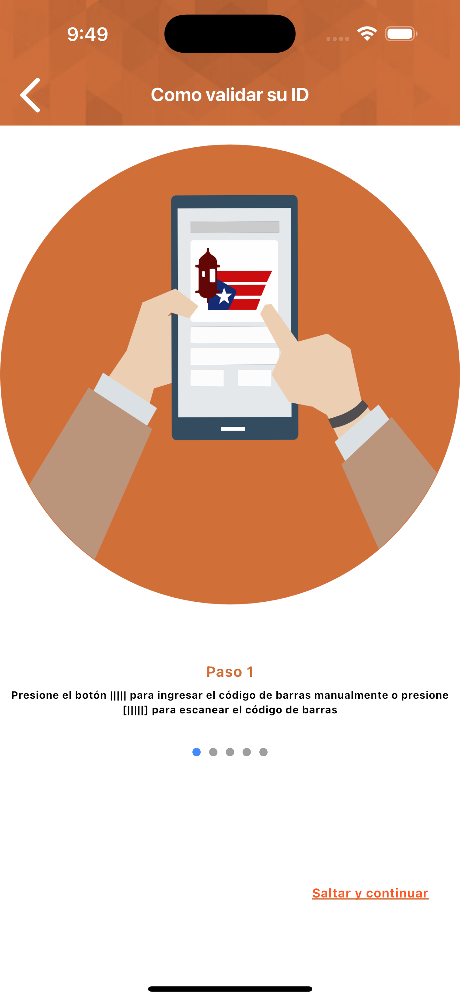
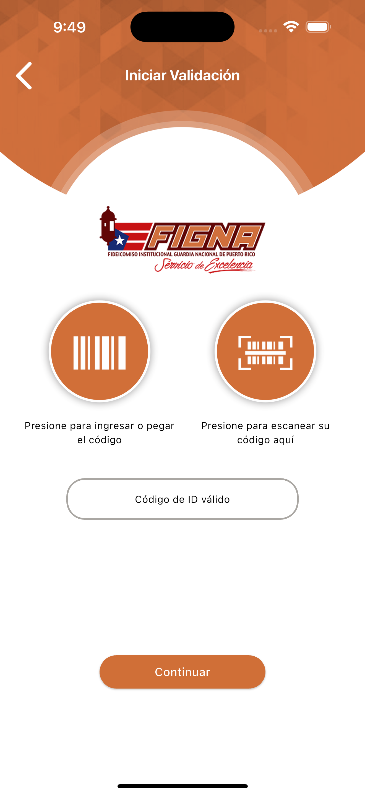
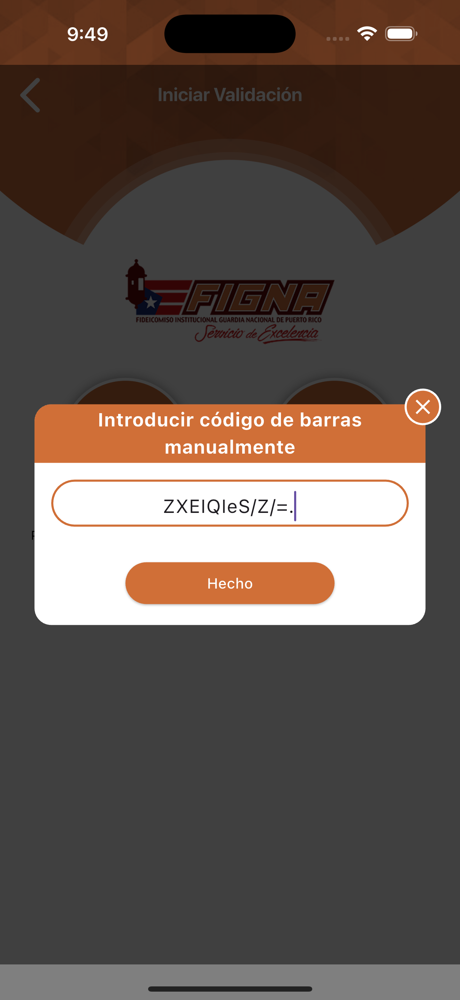

# 📱 App de Consulta de Estados de Cuenta y Saldos
### _(Proyecto para cliente privado)_

Aplicación móvil desarrollada para permitir a los usuarios consultar su información de cartera de forma segura, rápida y en tiempo real.

---

## 👨‍💻 Rol en el proyecto
- **Flutter Developer**
- Diseño e implementación de la app móvil
- Integración con servicios backend

---

## 📅 Información general
- **Año:** 2025
- **Estado:** En producción
- **Plataformas:** Android & iOS

---

## ✨ Funcionalidades principales
- Verificación segura de identidad de usuarios
- Sincronización de información
- Consulta de estados de cuenta y saldos
- Generación de reportes en tiempo real
- Soporte multi-idioma (ES / EN)

---

## 🛠️ Tecnologías utilizadas
- **Flutter**
- **Dart**
- **REST API**
- Arquitectura modular y consumo de servicios

---

## 📸 Capturas de pantalla
_(Interfaz ilustrativa — datos ficticios)_

  

  

  

  

  

---

## 🧩 Retos técnicos
- Implementación de soporte multi-idioma
- Manejo de estado para configuración inicial
- Diseño de UI adaptable a Android e iOS

---

## 🔒 Confidencialidad
> ⚠️ El código fuente de este proyecto es privado por acuerdo de confidencialidad con el cliente.  
> Las imágenes presentadas son ilustrativas y no contienen información sensible.
